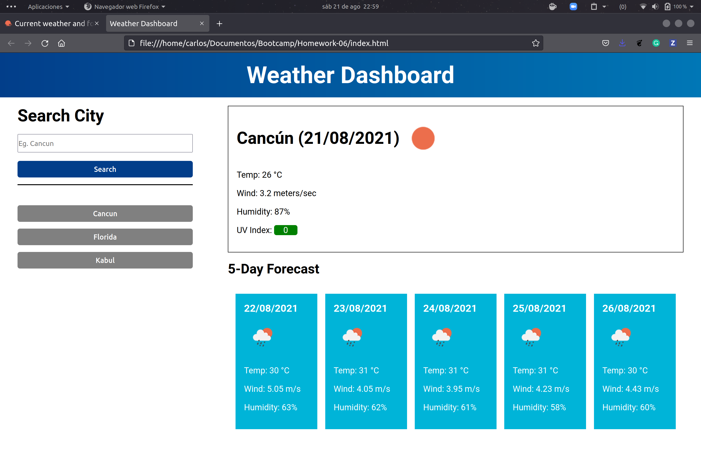

# Weather Dashboard

## 📃 Project Description

This project is a weather forecast application that connects to a third party API in order to search for the current weather in the desired city. It also shows the forecast for the next five days. 

Visit the deployed project at:

https://carlosp1806.github.io/Weather-Dashboard/

## 🤖 Technologies Used
- HTML
- CSS
- JavaScript

## 🎯 Learning Objectives 

I was motivated to build this learning project in order to acquire or strenghten the following developer skills:
- Show proficiency in connecting to third party APIs
- Understand how to use Local Storage to save client-side data
- Expand my knowledge in building a small scale JavaScript application

## ⚙️ Functionality

Use the form to search for the weather forecast in the desired city. This will automatically update the search history, which can be used for easier access to commonly consulted cities. This is an image of the live application:

## Credits
The API information was taken from https://openweathermap.org/
